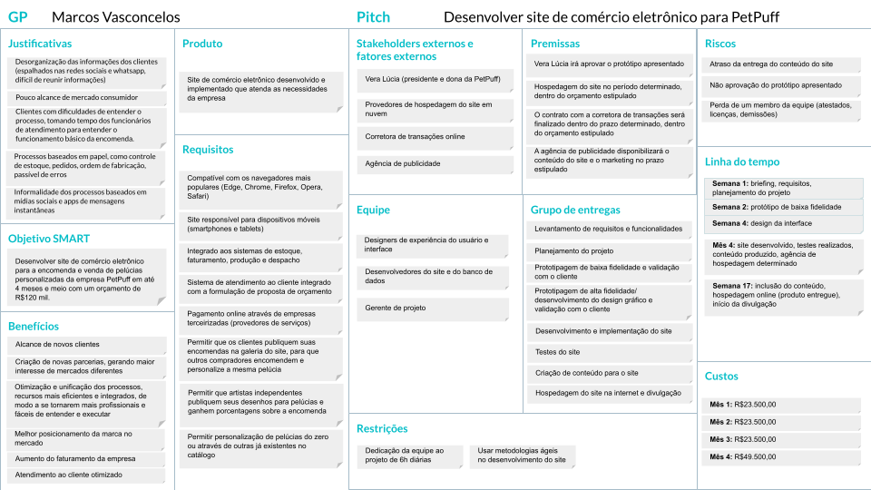
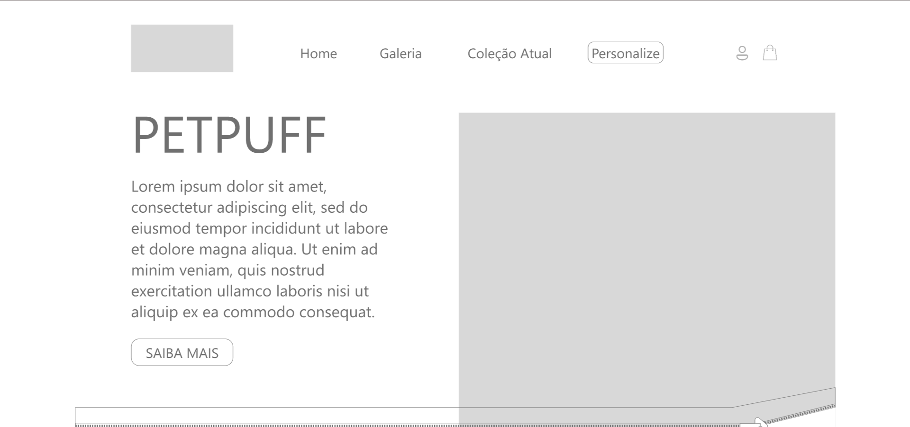

# PetPuff
[TRABALHO ACADÊMICO] Estudo de caso de comércio eletrônico

***Autores:** Beatriz Auer Mariano e Mateus Maioli Giacomin* 
***Coautores:** Isadora Laurindo Brandão*

## Resumo do trabalho
Esse trabalho foi desenvolvido ao longo de três disciplinas do curso Bacharelado em Sistemas de Informação.

**2022/1 Introdução a Sistemas de Informação**  
Esse trabalho foi desenvolvido em duas partes.  A primeira se deu com o objetivo de elaborar, organizar e estruturar as informações da empresa, de modo a abranger as áreas de administração que são correlatas ao estudo dos sistemas de informação. Já a segunda parte se deu com a ideação e prototipagem do sistema de comércio eletrônico pensando para a empresa elaborada na primeira parte.

Ambos os trabalhos podem ser acessados aqui:
[Trabalho 1](doc/T1_BeatrizMarianoMateusMaioli.pdf) |
[Trabalho 2](doc/T2_BeatrizMarianoMateusMaioli.pdf)

**2024/1 Projeto de Sistemas** 
Em um primeiro momento, realizamos a etapa de análise de um sistema de informação. Isso consistiu em levantar e documentar requisitos de acordo com o material desenvolvido em 2022/1, modelar os casos de uso e diagrama de classes do sistema. Você pode acessar a documentação completa aqui: [Análise do Sistema](doc/Trabalho%201%20-%20Analise.pdf).

**2024/1 Desenvolvimento web** 
*Em breve*

## Resumo da empresa

A PetPuff tem como objetivo produzir pelúcias personalizadas com base nos desenhos e   descrição de seus clientes – em geral, crianças. Frente às mudanças mercadológicas e a   possibilidade de alcance de novos clientes, a empresa busca se adaptar às novas tecnologias e  implementar um sistema de comércio eletrônico integrado aos sistemas de transações da  empresa (estoque, relacionamento com o cliente, contabilidade, produção e despacho), de modo  a expandir o mercado consumidor para todos os estados do Brasil

### PMC

O PMC do desenvolvimento do site de comércio eletrônico pode ser acessado [aqui](doc/PetPuff_PMC.pdf).

### Mapa de navegação

### Protótipo: site de comércio eletrônico

O protótipo navegável do site pode ser acessado [aqui](https://xd.adobe.com/view/22463702-5310-42eb-8376-3dc1cf223ecd-7715/?fullscreen&hints=off).
Já seu modelo em PDF, com todas as páginas compiladas, [aqui](doc/PetPuff_Site.pdf).

### Protótipo: dashboard (visualização de dados para gerência)

O protótipo navegável do site pode ser acessado [aqui](https://xd.adobe.com/view/12fbce01-c52e-4968-b49c-0b4207d0ee0e-47a8/?fullscreen&hints=off).
Já seu modelo em PDF, com todas as páginas compiladas, [aqui](doc/PetPuff_ADM.pdf).

