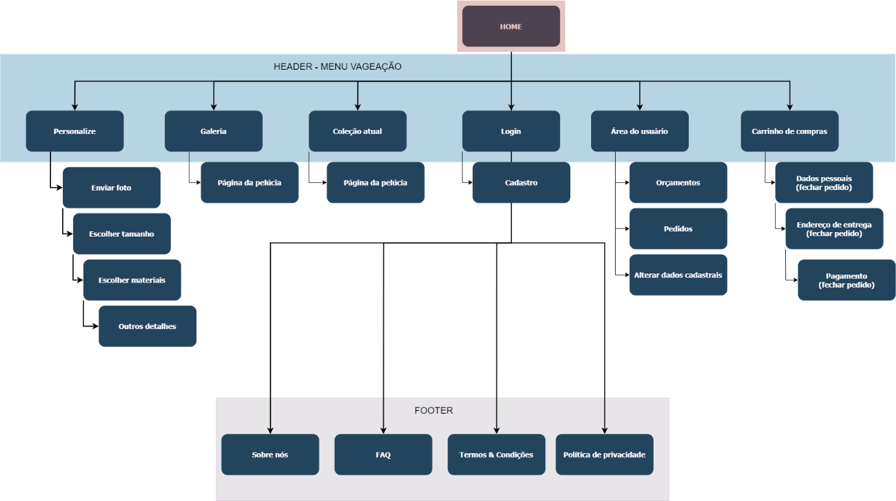

# PetPuff
[TRABALHO ACADÊMICO] Estudo de caso de comércio eletrônico

***Autores:** Beatriz Auer Mariano e Mateus Maioli Giacomin*<br>
***Coautores:** Isadora Laurindo Brandão*

## Resumo do trabalho
Esse trabalho foi desenvolvido ao longo de três disciplinas do curso Bacharelado em Sistemas de Informação.

**2022/1 Introdução a Sistemas de Informação** <br>
Esse trabalho foi desenvolvido em duas partes.  A primeira se deu com o objetivo de elaborar, organizar e estruturar as informações da empresa, de modo a abranger as áreas de administração que são correlatas ao estudo dos sistemas de informação. Já a segunda parte se deu com a ideação e prototipagem do sistema de comércio eletrônico pensando para a empresa elaborada na primeira parte.

Ambos os trabalhos podem ser acessados aqui:
[Trabalho 1](doc/T1_BeatrizMarianoMateusMaioli.pdf) |
[Trabalho 2](doc/T2_BeatrizMarianoMateusMaioli.pdf)

**2024/1 Projeto de Sistemas**<br>
Em um primeiro momento, realizamos a etapa de análise de um sistema de informação. Isso consistiu em levantar e documentar requisitos de acordo com o material desenvolvido em 2022/1, modelar os casos de uso e diagrama de classes do sistema. Você pode acessar a documentação completa aqui: [Análise do Sistema](doc/Trabalho%201%20-%20Analise.pdf).

**2024/1 Desenvolvimento web**<br>
*Em breve*

## Guia de desenvolvimento

Esse repositório contem as APIs do sistema e retorna dados crus em formato JSON, tal qual estudado na disciplina de desenvolvimento web.

Todo o código do backend está escrito em **typescript**.

**NÃO** suba para o repositório:
* A pasta `dist`
* A pasta `node_modules`
* O arquivo `package-lock.json`
* O arquivo `.env`
* O arquivo `tsconfig.json`

### Arquivo tsconfig.json

O seu arquivo deve conter, pelo menos, as seguintes instruções:

```
{
  "compilerOptions": {
    "target": "es2016",
    "module": "commonjs",
    "rootDir": "./src",
    "outDir": "./dist",
    "esModuleInterop": true,
    "forceConsistentCasingInFileNames": true,
    "skipLibCheck": true
  },
  "include": ["src/**/*.ts"],
  "exclude": ["node_modules"]
}
```

### Rodando o código

Para iniciar o servidor, rode o comando `npm run start`.

### Mensagens de commit

É de bom tom manter um padrão ao enviar commits para o repositório.

* `feat` seu código adiciona uma nova feature (funcionalidade)
* `fix` seu código está corrigindo algum bug
* `chore` uma tarefa simples que ficou para trás, como atualizar esse arquivo
* `refactor` reescrita de parte do código (otimização, nomes de variáveis e arquivos, etc. Cuidado para não confundir com uma feature)

### Padrões de código

Também é de bom tom manter padrões de desenvolvimento e escrita de código. Sugestões:

* Instale o **Eslint** e o **Prettier**
* Uso de aspas simples
* Nomes de **variáveis** sempre minúsculas, sempre descritivas, uso de camel case
    * Bom nome de variável: nomeCliente
    * Péssimo nome de variável: N
* Nomes de **classes** sempre começam em maiúsculo
    * Exemplo: MinhaClasse
    * Exemplo ruim: MINHACLASSE
* Uso de aspas simpels (padrão da comunidade de devs javascript/typescrit)
* Evitar o uso de ponto e vírgula (padrão da comunidade de devs javascript/typescrit)
* Evitar comentários em excesso
* Evitar funções gigantescas. Tente quebrá-las em funções menores e mais descritivas ("é mais fácil entender o que 10 funções de 10 linhas fazem do que 1 função de 100")


## Resumo da empresa

A PetPuff tem como objetivo produzir pelúcias personalizadas com base nos desenhos e   descrição de seus clientes – em geral, crianças. Frente às mudanças mercadológicas e a   possibilidade de alcance de novos clientes, a empresa busca se adaptar às novas tecnologias e  implementar um sistema de comércio eletrônico integrado aos sistemas de transações da  empresa (estoque, relacionamento com o cliente, contabilidade, produção e despacho), de modo  a expandir o mercado consumidor para todos os estados do Brasil

### PMC

O PMC do desenvolvimento do site de comércio eletrônico pode ser acessado [aqui](doc/PetPuff_PMC.pdf).


### Mapa de navegação



### Protótipo: site de comércio eletrônico

O protótipo navegável do site pode ser acessado [aqui](https://xd.adobe.com/view/22463702-5310-42eb-8376-3dc1cf223ecd-7715/?fullscreen&hints=off).
Já seu modelo em PDF, com todas as páginas compiladas, [aqui](doc/PetPuff_Site.pdf).


### Protótipo: dashboard (visualização de dados para gerência)

O protótipo navegável do site pode ser acessado [aqui](https://xd.adobe.com/view/12fbce01-c52e-4968-b49c-0b4207d0ee0e-47a8/?fullscreen&hints=off).
Já seu modelo em PDF, com todas as páginas compiladas, [aqui](doc/PetPuff_ADM.pdf).


